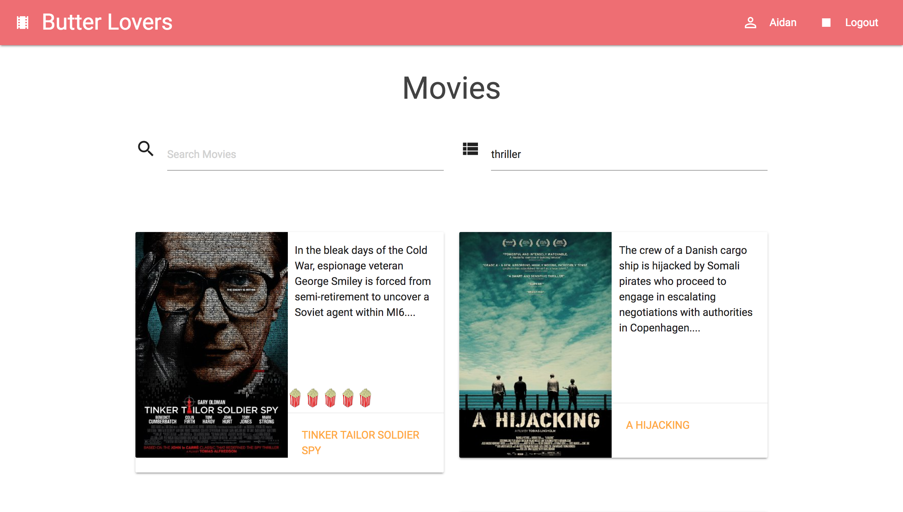
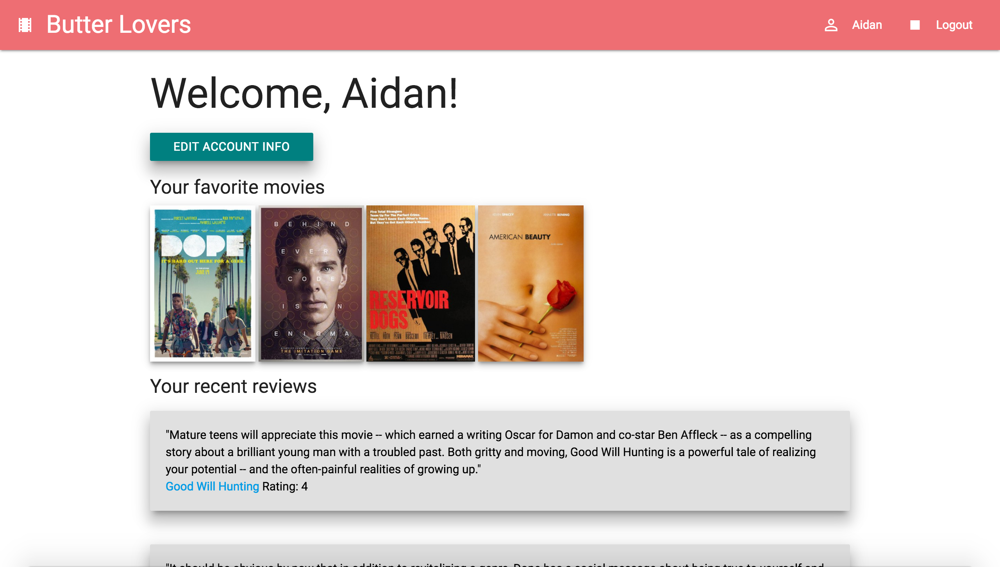

# Butter Lovers

Film review app with a unique popcorn rating system that displays verified film critic reviews with precedence over basic user reviews and allows users to make comments on films.

## Deployed to Heroku
[Butter Lovers](https://polar-gorge-76869.herokuapp.com/movies)

## User stories

#### - A user can sign-up
#### - A user can login and logout
#### - A user can search a film by title
#### - A user can search a film by genre
#### - A user can review a film
#### - A user can comment on film reviews
#### - A user can give a popcorn rating to a film
#### - A user can view a list of previous reviews
#### - A user can view a list of previous comments
#### - A user can view a collection of their favorite films 
#### - A user can view a synopsis of a film

## Segments

###Sign up

###Log in

###Title search

###Genre search

###Film page

###User page

###Account update

##Whiteboarding

##Things we covered on this project:

#### - Ruby on Rails

#### - Materialize

#### - User authentication with BCrypt

#### - OMDB API

#### - Heroku deployment

#### - Agile Team Workflow

#### - Git Workflow

#### - Pair Programming

